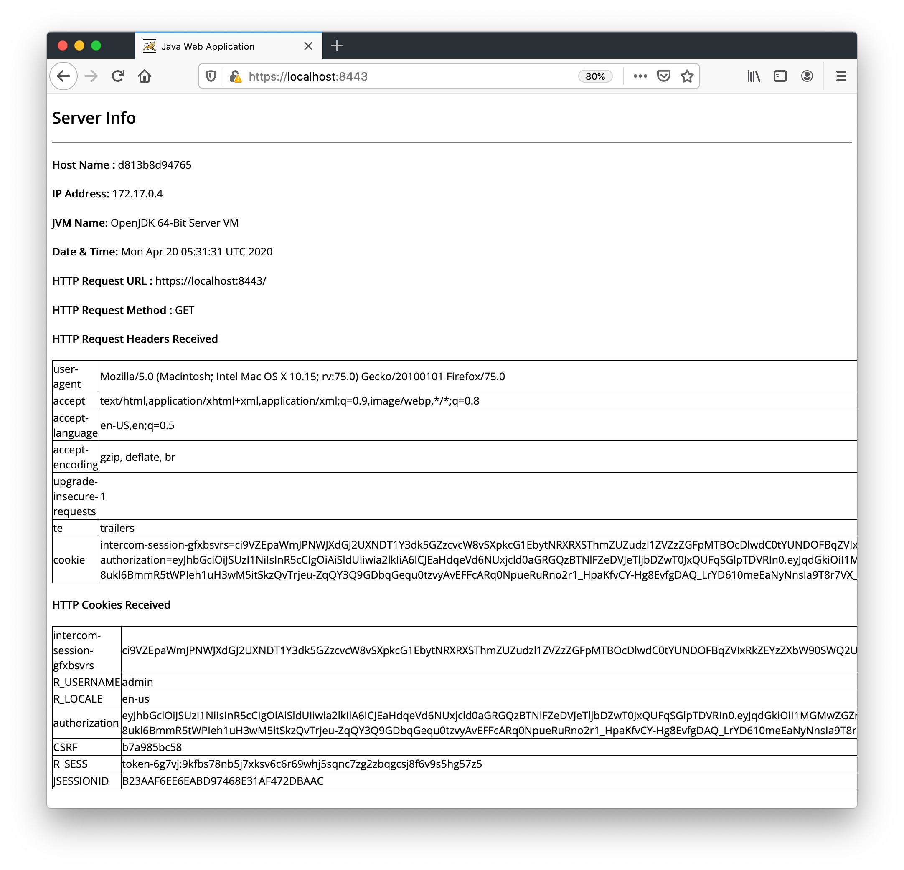
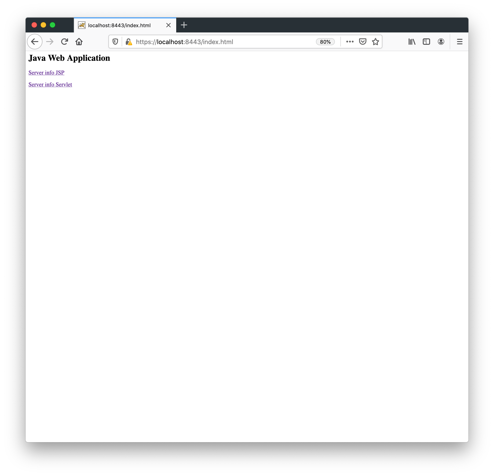

[](https://travis-ci.org/AndriyKalashnykov/tomcat-root-war)

# Java Web Application example

ROOT.war replaces Tomcat's default ROOT application - $TOMCAT_HOME/webapps/ROOT

### Test with Jetty web server

```shell
git clone git@github.com:AndriyKalashnykov/tomcat-root-war.git
cd tomcat-root-war
mvn jetty:run

open http://localhost:8080
```

Access http://localhost:8080

### Create WAR file

```shell
git clone git@github.com:AndriyKalashnykov/tomcat-root-war.git
cd tomcat-root-war
mvn clean install
```

### List content of generated WAR file

```shell
jar tf ./target/ROOT.war
```
### Replace TOMCAT ROOT application

Edit `$TOMCAT_HOME/conf/server.xml`

```xml
<Host name="localhost"  appBase="webapps" unpackWARs="true" autoDeploy="false" deployOnStartUp="false">
```

`autoDeploy` and `deployOnStartUp` needs to be set to `false`

Remove default ROOT folder and copy ROOT.war
```shell
rm -rf $TOMCAT_HOME/webapps/ROOT
rm -f $TOMCAT_HOME/webapps/ROOT.war
cp ./target/ROOT.war $TOMCAT_HOME/webapps/ROOT.war
```

## Links
[Docker image of this application deployed onto Customized Bitnami Tomcat 9](https://hub.docker.com/r/andriykalashnykov/bitnami-tomcat9-jdk18-root-war)

### Java Web Application UI

Default welcome page - InfoServlet


index.html


