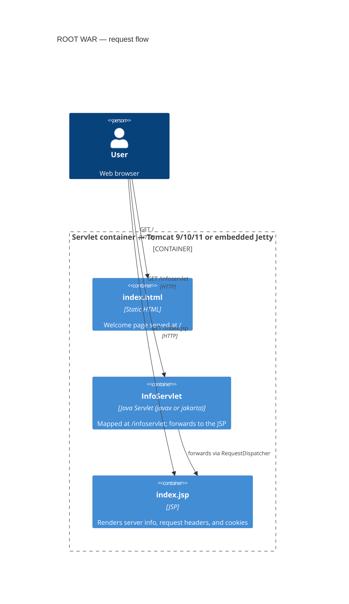

[](https://github.com/AndriyKalashnykov/tomcat-root-war/actions/workflows/ci.yml)
[](https://hits.sh/github.com/AndriyKalashnykov/tomcat-root-war/)
[](https://opensource.org/licenses/MIT)
[](https://app.renovatebot.com/dashboard#github/AndriyKalashnykov/tomcat-root-war)

# Tomcat ROOT WAR

A minimal Java web application that replaces Tomcat's default ROOT webapp (`$TOMCAT_HOME/webapps/ROOT`). Displays server info, request headers, and cookies via a servlet and JSP page.

Supports **Tomcat 9**, **10**, and **11** via Maven profiles.


```mermaid
C4Container
    title ROOT WAR — request flow

    Person(user, "User", "Web browser")

    Container_Boundary(container, "Servlet container — Tomcat 9/10/11 or embedded Jetty") {
        Container(html, "index.html", "Static HTML", "Welcome page served at /")
        Container(servlet, "InfoServlet", "Java Servlet (javax or jakarta)", "Mapped at /infoservlet; forwards to the JSP")
        Container(jsp, "index.jsp", "JSP", "Renders server info, request headers, and cookies")
    }

    Rel(user, html, "GET /", "HTTP")
    Rel(user, servlet, "GET /infoservlet", "HTTP")
    Rel(user, jsp, "GET /index.jsp", "HTTP")
    Rel(servlet, jsp, "forwards via RequestDispatcher")

    UpdateLayoutConfig($c4ShapeInRow="1", $c4BoundaryInRow="1")
```

The WAR deploys at context path `/` (replacing the container's default ROOT app). A single codebase targets both the `javax.servlet` (Tomcat 9) and `jakarta.servlet` (Tomcat 10/11) namespaces via Maven profiles that select the matching source tree (`src/main/java` vs `src/main/java-jakarta`).

## Quick Start

```bash
make deps          # install the toolchain (JDK, Maven, node, act) via mise
make build         # build ROOT.war (Tomcat 9 by default)
make jetty-run     # run locally with embedded Jetty
# open http://localhost:8080/
```

## Prerequisites

The toolchain (JDK, Maven, node, act) is managed by [mise](https://mise.jdx.dev/) and pinned in [`.mise.toml`](.mise.toml). Install mise once, then `make deps` installs everything else.

| Tool | Version | Purpose |
|------|---------|---------|
| [GNU Make](https://www.gnu.org/software/make/) | 3.81+ | Build orchestration |
| [mise](https://mise.jdx.dev/) | latest | Toolchain version manager (provides JDK, Maven, node, act) |
| [JDK](https://adoptium.net/) | 11/17/21 | Java runtime and compiler (provided by mise; local dev uses JDK 21) |
| [Maven](https://maven.apache.org/) | 3.9+ | Build and dependency management (provided by mise) |
| [act](https://github.com/nektos/act) | pinned | Local GitHub Actions testing (provided by mise, optional) |

Install mise (see the [mise docs](https://mise.jdx.dev/getting-started.html)), then install all pinned tools:

```bash
curl https://mise.run | sh   # one-time mise install
make deps                    # install JDK, Maven, node, act from .mise.toml
```

## Build Profiles

Each profile targets a specific Tomcat version with the appropriate Servlet API:

| Profile | Tomcat | Servlet API | Java | JDK |
|---------|--------|-------------|------|-----|
| `tomcat9` (default) | 9.0.x | `javax.servlet` 4.0 | 11 | 11-tem |
| `tomcat10` | 10.1.x | `jakarta.servlet` 6.1 | 17 | 17-tem |
| `tomcat11` | 11.0.x | `jakarta.servlet` 6.1 | 21 | 21-tem |

Select a profile with `PROFILE=`:

```bash
make build                       # Tomcat 9 (default)
make build PROFILE=tomcat10      # Tomcat 10
make build PROFILE=tomcat11      # Tomcat 11
```

## Available Make Targets

Run `make help` to see all available targets.

### Build & Run

| Target | Description |
|--------|-------------|
| `make build` | Build ROOT.war (use PROFILE=tomcat9\|tomcat10\|tomcat11) |
| `make test` | Run the JUnit 5 + Mockito unit tests (use PROFILE=tomcat9\|tomcat10\|tomcat11) |
| `make lint` | Validate POM and project structure (`mvn validate`) |
| `make clean` | Cleanup build artifacts |
| `make run` | Run locally with Jetty (alias for jetty-run) |
| `make jetty-run` | Run locally with embedded Jetty server |
| `make verify-all` | Verify build compiles for all Tomcat profiles |

### Code Quality & Security

| Target | Description |
|--------|-------------|
| `make static-check` | Run all static analysis (`lint` + `trivy-fs` + `gitleaks-scan` + `mermaid-lint`) |
| `make trivy-fs` | Scan the filesystem for vulnerabilities and secrets ([Trivy](https://github.com/aquasecurity/trivy)) |
| `make gitleaks-scan` | Scan the working tree for committed secrets ([gitleaks](https://github.com/gitleaks/gitleaks)) |
| `make mermaid-lint` | Validate the README Mermaid diagram with [mermaid-cli](https://github.com/mermaid-js/mermaid-cli) (GitHub's renderer) |

### Deployment

| Target | Description |
|--------|-------------|
| `make deploy` | Build and deploy ROOT.war to Tomcat |
| `make tomcat-install` | Download and install Tomcat 9, 10, 11 to ~/tomcat/ |
| `make tomcat-switch` | Switch active Tomcat version |

### CI

| Target | Description |
|--------|-------------|
| `make ci` | Run full local CI pipeline |
| `make ci-run` | Run GitHub Actions workflow locally via [act](https://github.com/nektos/act) |

### Dependencies & Utilities

| Target | Description |
|--------|-------------|
| `make deps` | Install the toolchain (JDK, Maven, node, act) via mise |
| `make deps-print-updates` | Print project dependency updates |
| `make deps-update` | Update dependencies to latest releases |
| `make renovate-validate` | Validate Renovate configuration |
| `make release` | Create and push a new tag |

All profile-aware targets default to `tomcat9`. Set `PROFILE=tomcat10` or `PROFILE=tomcat11` to override.

## Install Tomcat

Downloads and installs Tomcat 9, 10, and 11 to `~/tomcat/{9,10,11}` with a `~/tomcat/current` symlink:

```bash
make tomcat-install
```

The install script can also be called directly:

```bash
./scripts/install-tomcat.sh                    # install all versions
./scripts/install-tomcat.sh --versions 10,11   # install specific versions
./scripts/install-tomcat.sh --current 10       # switch current symlink to Tomcat 10
```

Add these to your shell profile (`~/.bashrc` or `~/.zshrc`):

```bash
export TOMCAT_HOME=~/tomcat/current
export CATALINA_HOME=$TOMCAT_HOME
```

## Deploy

Build `ROOT.war` and deploy it to the matching Tomcat installation:

```bash
make deploy                      # Tomcat 9
make deploy PROFILE=tomcat10     # Tomcat 10
make deploy PROFILE=tomcat11     # Tomcat 11
```

<details>
<summary>Manual deployment</summary>

Edit `$TOMCAT_HOME/conf/server.xml` &mdash; set `autoDeploy` and `deployOnStartUp` to `false`:

```xml
<Host name="localhost" appBase="webapps" unpackWARs="true" autoDeploy="false" deployOnStartUp="false">
```

Then copy the WAR:

```bash
rm -rf $TOMCAT_HOME/webapps/ROOT/
rm -f $TOMCAT_HOME/webapps/ROOT.war
cp ./target/ROOT.war $TOMCAT_HOME/webapps/ROOT.war
```
</details>

## Start / Stop Tomcat

```bash
~/tomcat/current/bin/startup.sh          # start
xdg-open http://localhost:8080/          # open in browser
tail -f ~/tomcat/current/logs/catalina.out   # view logs
~/tomcat/current/bin/shutdown.sh          # stop
```

To run a specific version instead of `current`:

```bash
~/tomcat/10/bin/startup.sh
~/tomcat/10/bin/shutdown.sh
```

To switch which version `current` points to:

```bash
make tomcat-switch PROFILE=tomcat11
```

## Run Locally with Jetty (no Tomcat install needed)

```bash
make jetty-run                       # Tomcat 9
make jetty-run PROFILE=tomcat10      # Tomcat 10
make jetty-run PROFILE=tomcat11      # Tomcat 11
```

Then open http://localhost:8080/index.html

## Uninstall Tomcat

```bash
rm -rf ~/tomcat/9         # remove a specific version
rm -rf ~/tomcat           # remove everything
```

Remove the `TOMCAT_HOME` and `CATALINA_HOME` exports from your shell profile.

## Building WAR in Secure Environments

If your environment enforces SSL certificate validation:

```bash
mvn clean install \
  -Daether.connector.https.securityMode=insecure \
  -Dmaven.wagon.http.ssl.insecure=true \
  -Dmaven.wagon.http.ssl.allowall=true \
  -Dmaven.wagon.http.ssl.ignore.validity.dates=true
```

## Inspect WAR Contents

```bash
jar tf ./target/ROOT.war
```

## CI/CD

GitHub Actions runs on every push to `master`, tags `v*`, and pull requests.

| Job | Triggers | Purpose |
|-----|----------|---------|
| **changes** | push (master, tags), PR | Detect whether code paths changed (skips the build on docs-only changes) |
| **build** | when `changes` reports code | Lint, Build, Test across the JDK × Tomcat matrix |
| **ci-pass** | always | Aggregator gate — the single required status check |

The **build** job uses a matrix strategy testing across JDK 11/18/25 with Tomcat 9, JDK 18/25 with Tomcat 10, and JDK 25 with Tomcat 11. The JDK for each leg is provided by [mise](https://mise.jdx.dev/) via the `MISE_JAVA_VERSION` override.

[Renovate](https://docs.renovatebot.com/) keeps dependencies up to date with PR automerge enabled (gated on the `ci-pass` check).

## Screenshots

Default welcome page &mdash; [http://localhost:8080/](http://localhost:8080/)


JSP &mdash; [http://localhost:8080/index.jsp](http://localhost:8080/index.jsp)


Servlet &mdash; [http://localhost:8080/infoservlet](http://localhost:8080/infoservlet)


HTML &mdash; [http://localhost:8080/index.html](http://localhost:8080/index.html)


## Used In

- [Java Web Application (WAR) deployed as root "/" context onto Customized Bitnami Tomcat 9](https://github.com/AndriyKalashnykov/bitnami-tomcat9-jdk18-root-war)
- [Docker image of this application deployed onto Customized Bitnami Tomcat 9](https://hub.docker.com/r/andriykalashnykov/bitnami-tomcat9-jdk18-root-war)
