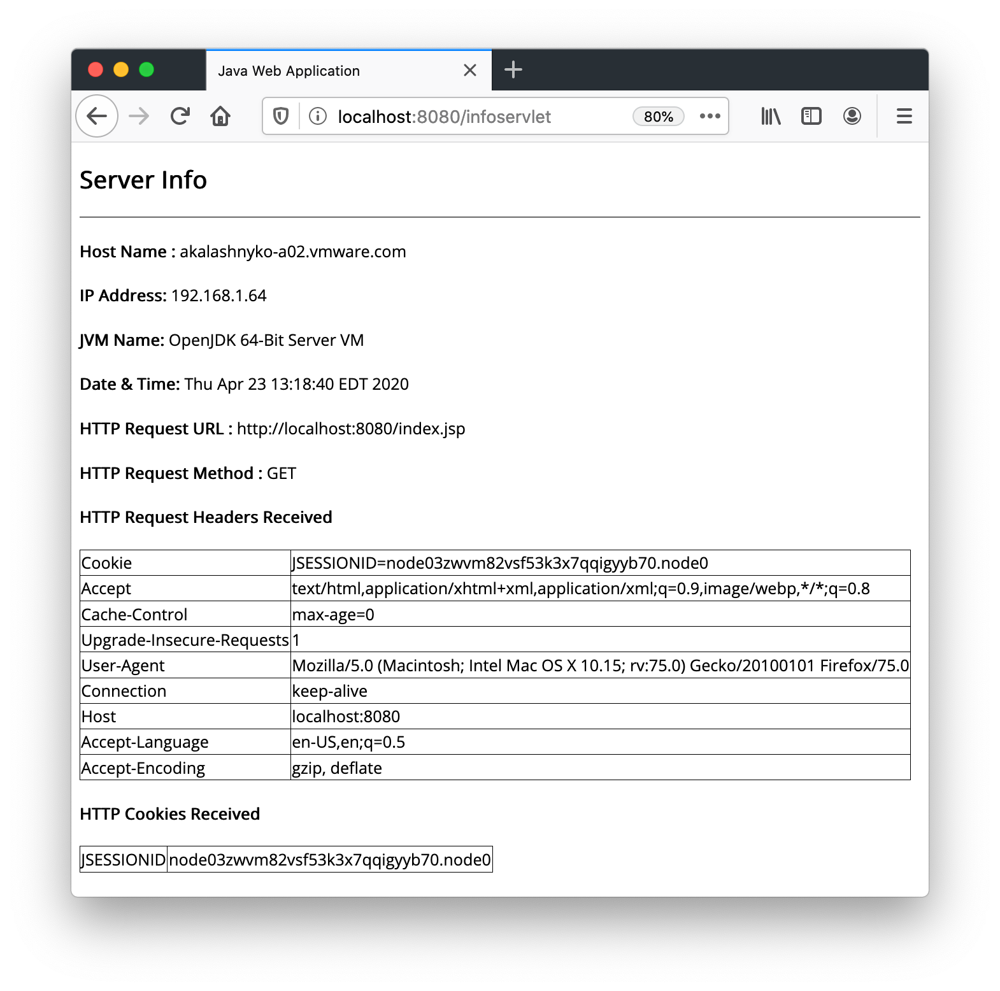
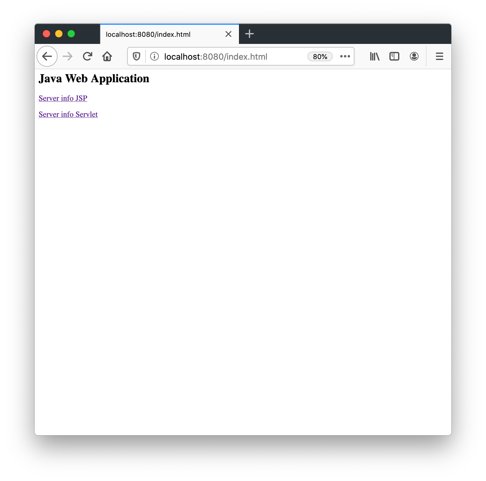

[](https://github.com/AndriyKalashnykov/tomcat-root-war/actions/workflows/ci.yml)
[](https://hits.sh/github.com/AndriyKalashnykov/tomcat-root-war/)
[](https://opensource.org/licenses/MIT)
[](https://app.renovatebot.com/dashboard#github/AndriyKalashnykov/tomcat-root-war)

# Tomcat ROOT WAR

A minimal Java web application that replaces Tomcat's default ROOT webapp (`$TOMCAT_HOME/webapps/ROOT`). Displays server info, request headers, and cookies via a servlet and JSP page.

Supports **Tomcat 9**, **10**, and **11** via Maven profiles.

## Quick Start

```bash
make deps-check    # install JDK and Maven via SDKMAN
make build         # build ROOT.war (Tomcat 9 by default)
make jetty-run     # run locally with embedded Jetty
# open http://localhost:8080/
```

## Prerequisites

| Tool | Version | Purpose |
|------|---------|---------|
| [GNU Make](https://www.gnu.org/software/make/) | 3.81+ | Build orchestration |
| [SDKMAN](https://sdkman.io/) | latest | Java/Maven version management |
| [JDK](https://adoptium.net/) | 11+ | Java runtime and compiler (installed via SDKMAN) |
| [Maven](https://maven.apache.org/) | 3.9+ | Build and dependency management (installed via SDKMAN) |
| [act](https://github.com/nektos/act) | latest | Local GitHub Actions testing (optional) |

Install all required dependencies:

```bash
make deps-check
```

## Build Profiles

Each profile targets a specific Tomcat version with the appropriate Servlet API:

| Profile | Tomcat | Servlet API | Java | JDK |
|---------|--------|-------------|------|-----|
| `tomcat9` (default) | 9.0.x | `javax.servlet` 4.0 | 11 | 11-tem |
| `tomcat10` | 10.1.x | `jakarta.servlet` 6.0 | 17 | 17-tem |
| `tomcat11` | 11.0.x | `jakarta.servlet` 6.1 | 21 | 21-tem |

Select a profile with `PROFILE=`:

```bash
make build                       # Tomcat 9 (default)
make build PROFILE=tomcat10      # Tomcat 10
make build PROFILE=tomcat11      # Tomcat 11
```

## Available Make Targets

Run `make help` to see all available targets.

### Build & Run

| Target | Description |
|--------|-------------|
| `make build` | Build ROOT.war (use PROFILE=tomcat9\|tomcat10\|tomcat11) |
| `make test` | Run tests (use PROFILE=tomcat9\|tomcat10\|tomcat11) |
| `make lint` | Check code style with Maven Checkstyle |
| `make clean` | Cleanup build artifacts |
| `make run` | Run locally with Jetty (alias for jetty-run) |
| `make jetty-run` | Run locally with embedded Jetty server |
| `make verify-all` | Verify build compiles for all Tomcat profiles |

### Deployment

| Target | Description |
|--------|-------------|
| `make deploy` | Build and deploy ROOT.war to Tomcat |
| `make tomcat-install` | Download and install Tomcat 9, 10, 11 to ~/tomcat/ |
| `make tomcat-switch` | Switch active Tomcat version |

### CI

| Target | Description |
|--------|-------------|
| `make ci` | Run full local CI pipeline |
| `make ci-run` | Run GitHub Actions workflow locally via [act](https://github.com/nektos/act) |

### Dependencies & Utilities

| Target | Description |
|--------|-------------|
| `make deps` | Check required tools are installed |
| `make deps-check` | Install JDK and Maven via SDKMAN |
| `make deps-ci` | Install Maven for CI environments |
| `make deps-act` | Install act for local GitHub Actions testing |
| `make deps-print-updates` | Print project dependency updates |
| `make deps-update` | Update dependencies to latest releases |
| `make env-check` | Check installed tools |
| `make renovate-bootstrap` | Install nvm and npm for Renovate |
| `make renovate-validate` | Validate Renovate configuration |
| `make release` | Create and push a new tag |

All profile-aware targets default to `tomcat9`. Set `PROFILE=tomcat10` or `PROFILE=tomcat11` to override.

## Install Tomcat

Downloads and installs Tomcat 9, 10, and 11 to `~/tomcat/{9,10,11}` with a `~/tomcat/current` symlink:

```bash
make tomcat-install
```

The install script can also be called directly:

```bash
./scripts/install-tomcat.sh                    # install all versions
./scripts/install-tomcat.sh --versions 10,11   # install specific versions
./scripts/install-tomcat.sh --current 10       # switch current symlink to Tomcat 10
```

Add these to your shell profile (`~/.bashrc` or `~/.zshrc`):

```bash
export TOMCAT_HOME=~/tomcat/current
export CATALINA_HOME=$TOMCAT_HOME
```

## Deploy

Build `ROOT.war` and deploy it to the matching Tomcat installation:

```bash
make deploy                      # Tomcat 9
make deploy PROFILE=tomcat10     # Tomcat 10
make deploy PROFILE=tomcat11     # Tomcat 11
```

<details>
<summary>Manual deployment</summary>

Edit `$TOMCAT_HOME/conf/server.xml` &mdash; set `autoDeploy` and `deployOnStartUp` to `false`:

```xml
<Host name="localhost" appBase="webapps" unpackWARs="true" autoDeploy="false" deployOnStartUp="false">
```

Then copy the WAR:

```bash
rm -rf $TOMCAT_HOME/webapps/ROOT/
rm -f $TOMCAT_HOME/webapps/ROOT.war
cp ./target/ROOT.war $TOMCAT_HOME/webapps/ROOT.war
```
</details>

## Start / Stop Tomcat

```bash
~/tomcat/current/bin/startup.sh          # start
xdg-open http://localhost:8080/          # open in browser
tail -f ~/tomcat/current/logs/catalina.out   # view logs
~/tomcat/current/bin/shutdown.sh          # stop
```

To run a specific version instead of `current`:

```bash
~/tomcat/10/bin/startup.sh
~/tomcat/10/bin/shutdown.sh
```

To switch which version `current` points to:

```bash
make tomcat-switch PROFILE=tomcat11
```

## Run Locally with Jetty (no Tomcat install needed)

```bash
make jetty-run                       # Tomcat 9
make jetty-run PROFILE=tomcat10      # Tomcat 10
make jetty-run PROFILE=tomcat11      # Tomcat 11
```

Then open http://localhost:8080/index.html

## Uninstall Tomcat

```bash
rm -rf ~/tomcat/9         # remove a specific version
rm -rf ~/tomcat           # remove everything
```

Remove the `TOMCAT_HOME` and `CATALINA_HOME` exports from your shell profile.

## Building WAR in Secure Environments

If your environment enforces SSL certificate validation:

```bash
mvn clean install \
  -Daether.connector.https.securityMode=insecure \
  -Dmaven.wagon.http.ssl.insecure=true \
  -Dmaven.wagon.http.ssl.allowall=true \
  -Dmaven.wagon.http.ssl.ignore.validity.dates=true
```

## Inspect WAR Contents

```bash
jar tf ./target/ROOT.war
```

## CI/CD

GitHub Actions runs on every push to `master`, tags `v*`, and pull requests.

| Job | Triggers | Steps |
|-----|----------|-------|
| **ci** | push (master, tags), PR | Lint, Build, Test |

The CI job uses a matrix strategy testing across JDK 11/18/25 with Tomcat 9, JDK 18/25 with Tomcat 10, and JDK 25 with Tomcat 11.

[Renovate](https://docs.renovatebot.com/) keeps dependencies up to date with platform automerge enabled.

## Screenshots

Default welcome page &mdash; [http://localhost:8080/](http://localhost:8080/)


JSP &mdash; [http://localhost:8080/index.jsp](http://localhost:8080/index.jsp)


Servlet &mdash; [http://localhost:8080/infoservlet](http://localhost:8080/infoservlet)


HTML &mdash; [http://localhost:8080/index.html](http://localhost:8080/index.html)


## Used In

- [Java Web Application (WAR) deployed as root "/" context onto Customized Bitnami Tomcat 9](https://github.com/AndriyKalashnykov/bitnami-tomcat9-jdk18-root-war)
- [Docker image of this application deployed onto Customized Bitnami Tomcat 9](https://hub.docker.com/r/andriykalashnykov/bitnami-tomcat9-jdk18-root-war)
